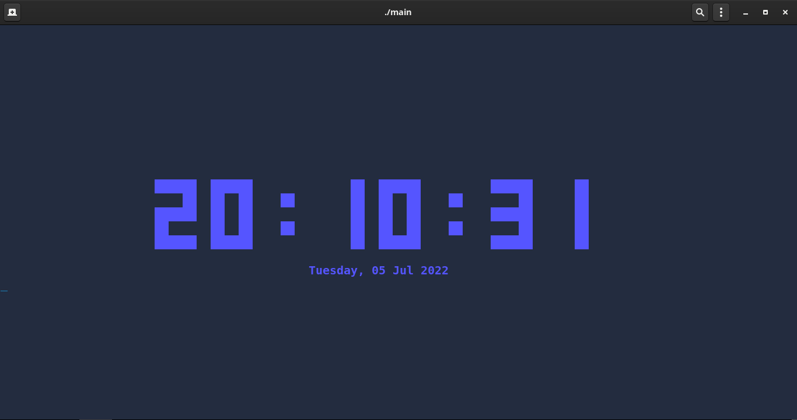
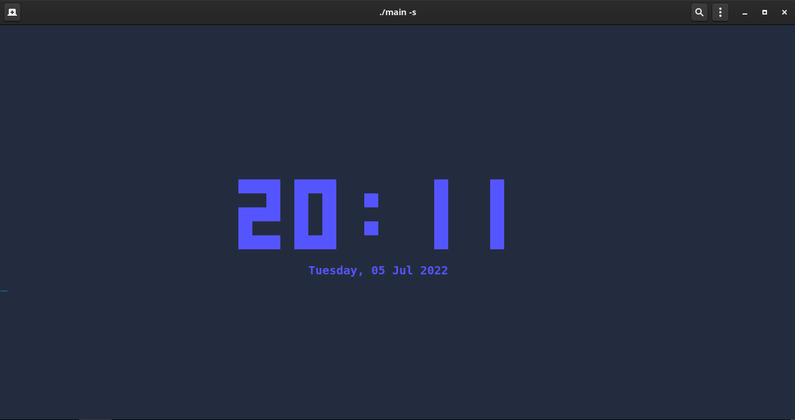

<div align="center">
    <h1>R-Clock</h1>
    
    <h1></h1>
</div>

## What's that
R-Clock is a clock for terminal interfaces, this will get the week day, month day, month, year, hours, minutes and opitionally seconds from your system. like a normal clock

## Small version
The program has a small version of the clock, if you wan't put the display in a small tmux or something like that. To use call the program with the first flag as "-s". This version will ignore the seconds, and will show the rest in display.

```sh
./R-Clock -s
```



## Goodbye
The project already has a compiled program in the file tree, but re-compile it, if you guess necessary.

